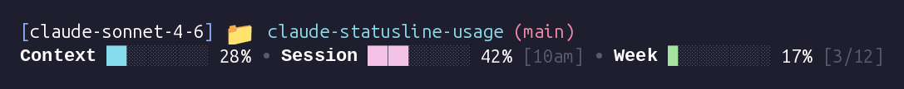

# claude-statusline-usage

A Claude Code statusline script that displays context window usage and subscription rate-limit burn inline in the terminal.

## Preview



## What it does

`src/statusline.sh` renders two lines:

- **Line 1:** active model, current folder, git branch
- **Line 2:** context window fill bar · session rate-limit bar · weekly rate-limit bar

Context is always shown. Session and weekly bars appear when `ccburn` data is available.

## Requirements

- Python 3.10+
- `bash`, `jq`, `git`, `awk` (standard on Linux/macOS)
- `ccburn` pip package (installed by `make setup`)

## Setup

```bash
make setup
```

This creates `.venv/`, installs `ccburn`, and symlinks `src/statusline.sh` to `~/.claude/statusline.sh`.

Then register the statusline in `~/.claude/settings.json`:

```json
{
  "statusCommand": "~/.claude/statusline.sh"
}
```

## Usage

### Statusline script

Test it manually:

```bash
make test
# or
echo '{"model":{"display_name":"claude-sonnet-4-6"},"context_window":{"used_percentage":42,"context_window_size":200000}}' | bash src/statusline.sh
```

Run the unit test suite:

```bash
make test-unit
```

### ccburn

```bash
# Interactive TUI (live-updating burn-up charts)
.venv/bin/ccburn session
.venv/bin/ccburn weekly

# JSON output for scripting
.venv/bin/ccburn --json --once
```

## Configuration

| Variable               | Default                      | Description                                  |
|------------------------|------------------------------|----------------------------------------------|
| `STATUSLINE_CACHE_DIR` | `~/.claude/cache`            | Directory for the ccburn response cache file |
| `STATUSLINE_CACHE_TTL` | `30` (seconds)               | How long to reuse a cached ccburn response   |
| `CCBURN_DATA`          | _(unset)_                    | Inject ccburn JSON directly; skips cache     |
| `GIT_BRANCH`           | _(unset)_                    | Override git branch detection                |

## Project structure

```
src/
  statusline.sh         Claude Code statusline script
tests/
  test_statusline.py    pytest suite
context/
  ccburn.md                     ccburn command and flag reference
  ccburn-sample-output.json     sample ccburn --json output
  usage-command-decompiled.md   reconstructed source of Claude Code's /usage tab
```
